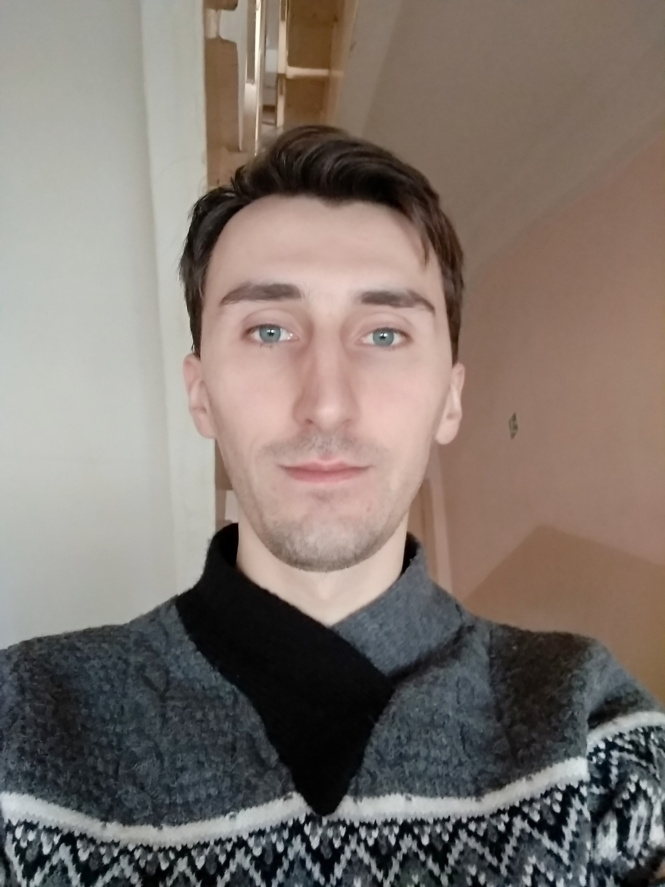

## Welcome to My GitHub Pages

### ABOUT ME

Let me introduce myself. My full name is Andrei Stryhelski. I from Minsk. I finished school in 2009. I graduated from Minsk Innovation University. I was trained as an economist.
Now I study at the Belarusian State University of Informatics and radioelectronics. My speciality is software information systems.
I work as a system Administrator. I succeed in my profession.
I like to program. My main programming language it C#.

### INTERESTS

My favorite sport is a chess. I have been playng chess for ten yers. Also I like playng football, ping-pong.

### MY CONTACTS

My mail: d9d9pe4kin@mail.ru
My codewars account: [Link](https://www.codewars.com/users/StryhelskiAndrei)
